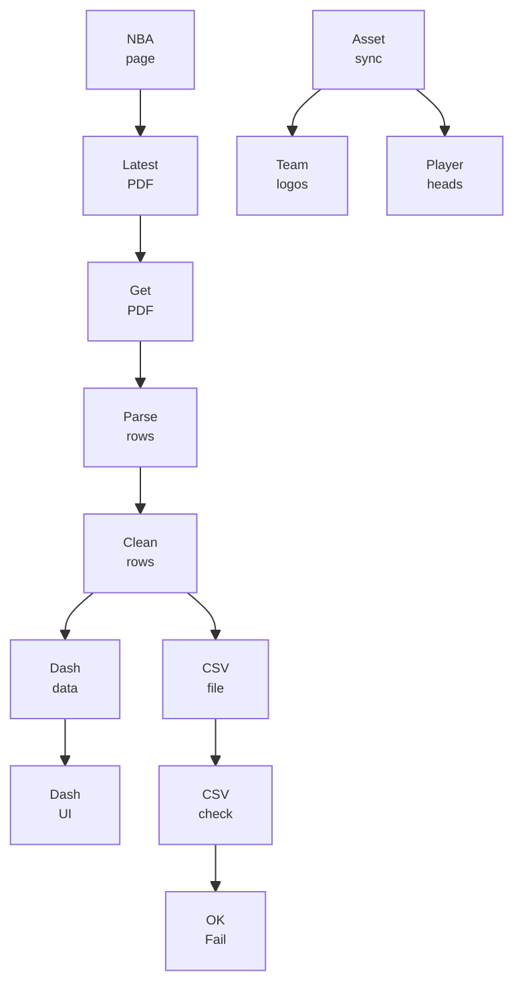

# Injury Report Dashboard

Production-ready NBA injury report scraper and dashboard.

## Copyright

Copyright (c) 2026 Lucas Berry.
SPDX-License-Identifier: MIT

## What this project does

- Scrapes the official NBA injury report page.
- Downloads the latest PDF report.
- Parses player status and absence reasons.
- Exposes the data in a Dash web dashboard.
- Writes normalized CSV files to `data/`.

## Pipeline Flow



## Project layout

- `injury_report_dashboard.py`: main production module (scraping, parsing, dashboard).
- `app.py`: compatibility entrypoint for local run/deployment.
- `validate_injury_report_csv.py`: generic CSV quality validator.
- `tests/test_validate_injury_report_csv.py`: unit tests for validator logic.
- `data/`: generated PDF/CSV artifacts.
- `assets/`: dashboard styles and static images:
  - team logos in `assets/team_logos/`
  - player headshots in `assets/player_headshots/` (files named with player slug + ID)
- `scripts/assets/sync_player_headshots.py`: downloads NBA headshots + name lookup map (accent-insensitive).
- `scripts/assets/sync_nba_assets.py`: one-command sync for team logos + player headshots.

## Quickstart

1. Install Python dependencies:

```bash
python3 -m venv .venv
. .venv/bin/activate
pip install -r requirements.txt
```

2. Run the dashboard:

```bash
python app.py
```

3. Open:

- `http://localhost:8050`

## Validate extracted CSV quality

Validate latest CSV in `data/`:

```bash
python validate_injury_report_csv.py
```

Validate an explicit CSV:

```bash
python validate_injury_report_csv.py data/Injury-Report_2026-02-07_06_00AM.csv
```

Strict mode (warnings become errors):

```bash
python validate_injury_report_csv.py --strict-warnings
```

## Sync Player Headshots

```bash
python scripts/assets/sync_player_headshots.py
```

Options:

- `--source active-and-reports` (default): active NBA players + any players found in local injury-report CSV files.
- `--source active`: active players only.
- `--source all`: full `nba_api` player catalog (slow).

## Sync Logos + Headshots

```bash
python scripts/assets/sync_nba_assets.py
```

Examples:

- Logos only: `python scripts/assets/sync_nba_assets.py --only logos --force-logos`
- Players only: `python scripts/assets/sync_nba_assets.py --only players --players-source active-and-reports`

## Run tests

```bash
python -m unittest discover -s tests -p 'test_*.py'
```

## Notes for production deployment

- Use `app.py` as the process entrypoint.
- Set `PORT` and `DASH_DEBUG=0` in production.
- Use `PDF_STORAGE_DIR` to control where PDF/CSV artifacts are written.
- Optionally set `ENABLE_SCHEDULER=0` if refresh is managed externally.
